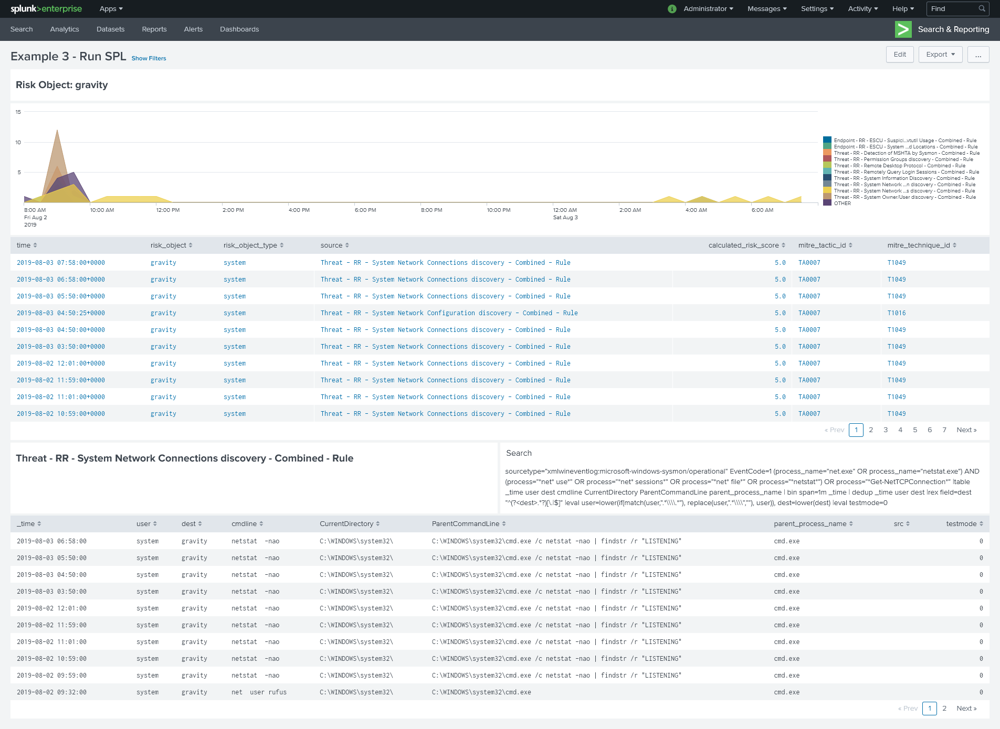

# RBA Drilldown

The included dashboards, saved searches, and work flow actions allow a user to more easily drill-down on RBA notables. Recent releases of ES have included RBA natively, however, they do not give an easy way to see the events triggered by the searches. This will be in an upcoming release but for now, these knowledge objects can help you get started.

# Overview

There are three different Examples for an RBA drilldown. This README will only cover v3. v1 and v2 are not as helpful as v3 but can serve as inspiration for other projects.

# Steps to configure

1. Create Saved Search to poplulate lookup
1. Create dashboard
1. Create work flow action

## Create Saved Search

A lookup of all correlation searches is created to help optimize the included dashboard. Use the [lookup_gen.spl](./lookup_gen.spl) to create a saved search. Ideally this would run on a periodic basis to keep the lookup up to date. This search creates a lookup named `org_csearch_lookup`. If you change the name, make a note of the new name as this will need to be updated in the dashboard.

## Create dashboard

Create a new dashboard and copy and paste the xml from [example_rul_spl_v3.xml](./example_run_spl_v3.xml). If you changed the name of the lookup in the previous steup, perform a find and replace for the new name. There should only be to locations where the name needs to be replaced. 

## Create WFA

Use the [workflow_action.txt](./workflow_action.txt) as a guide to create a new workflow action. This will allow you to pivot from the incident review dashboard to the newly created dashboard. 